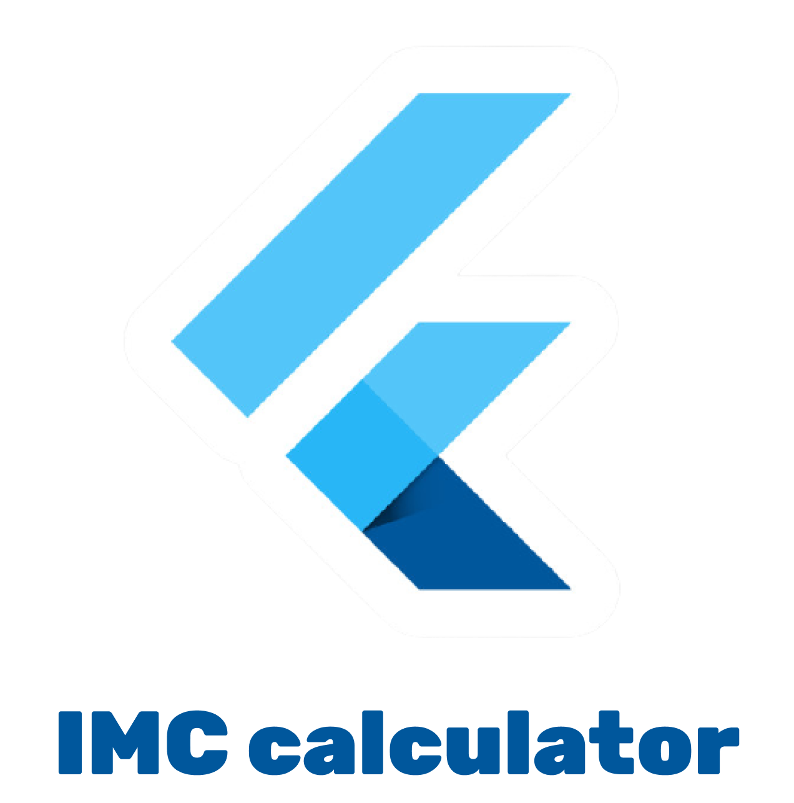
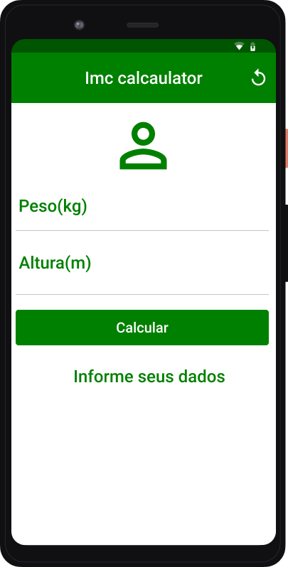

<h1 align="center">
  
</h1>

  

  

  

<h2 align="center">IMC calculator with Flutter</h2>

  Esse é meu primeiro aplicativo desenvolvido em Flutter. Uma simples calculadora de IMC
  que retorna ao usuário o valor do seu IMC e uma situação, de acordo com a tabela de faixas de peso do IMC.

## :rocket: Widgets utilizados no projeto.
- Scafflod;
- AppBar;
- IconButton (reload);
- Form, TextFormField;
- Padding, Container; 
- RaisedButton

Além de aprender conceitos como: manipulação de formulários e de erros com a GlobalKey.

